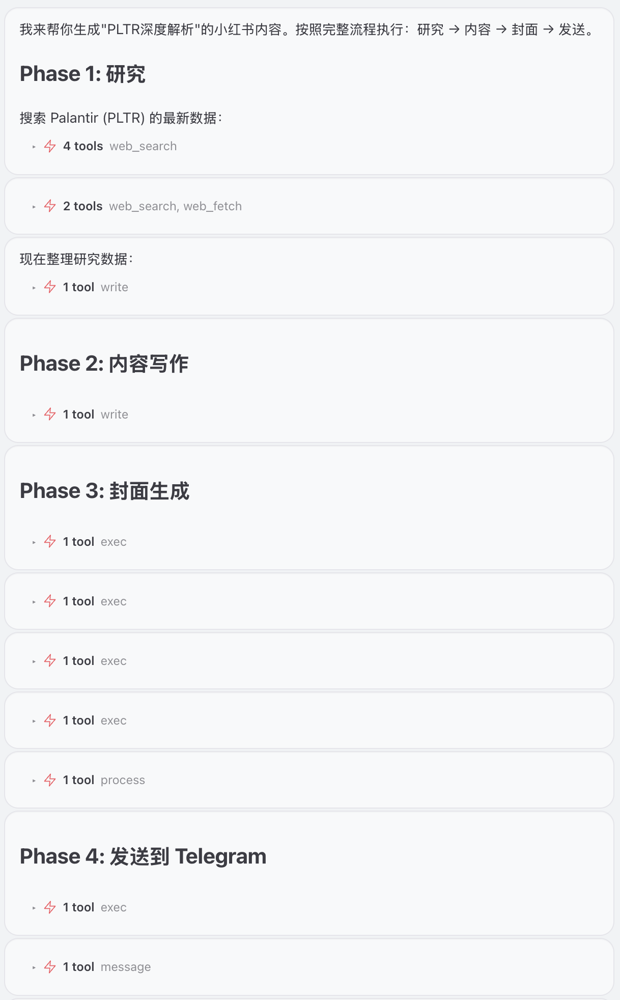
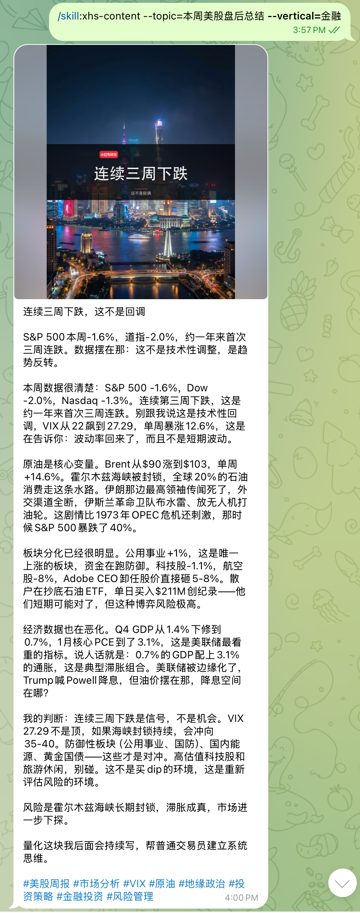
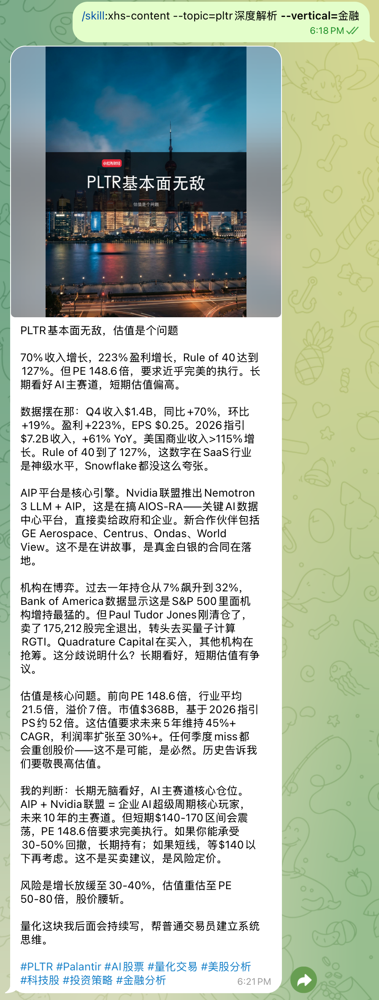

## 📖 项目介绍
**xiaohongshu-smart-gen** ———— 基于 OpenClaw 的小红书多垂类内容自动化生成 Skill

本工具通过 OpenClaw 实现从话题研究到内容创作的全链路自动化。采用配置驱动架构，支持金融、美妆、科技等多个垂类，每个垂类拥有独立的人设和内容风格。

内置的专业人设框架确保内容高质量、有特色，拒绝 AI 模式化表达。支持一键生成图文内容，极大提升内容生产效率。

起初是我想给自己提供一个灵活的内容生成工具
我发小红书, 原因有二: 1. 给自己的知识搜索学习留下一点痕迹 2. 证明AI是可以整合有时效性的高质量内容
之所以采用配置驱动架构是为了让这个技能更加通用, 一套技能支持多个垂类

<div align="center">


</div>

<div align="center">



**小红书智能内容生成系统** — 多垂类，配置驱动

`研究` → `内容` → `封面` → `发布`

</div>

## ✨ 示例效果

<table>
<tr>
<td align="center" width="50%">

<br />
<b>示例 1</b>
</td>
<td align="center" width="50%">

<br />
<b>示例 2</b>
</td>
</tr>
</table>

### 为什么需要这个工具？

- **节省时间**：从话题到发布，原本需要 1-2 小时的工作，现在几分钟完成
- **专业视角**：每个垂类独立人设，确保内容专业、有深度，拒绝 AI 感
- **配置驱动**：新增垂类只需添加配置，无需修改代码
- **风格统一**：遵循预设的人设规范，保持内容风格一致性

### 核心特性

| 特性 | 说明 |
|------|------|
| 📊 **多垂类支持** | 内置金融、美妆、科技，轻松扩展更多 |
| ✍️ **人设写作** | 每个垂类独立人设，口语化，拒绝 AI 痕迹 |
| 🎨 **AI 封面** | 多风格背景 + 本地合成文字，专业质感 |
| 📤 **一键发布** | 自动发送到 Telegram 频道或私聊 |
| 🔧 **配置驱动** | 新增垂类只需 JSON 配置，无需改代码 |

### 支持的垂类

| 垂类 | 代码 | 人设 | 特点 |
|------|------|------|------|
| 金融投资 | `finance` | 量化交易员 | 数据驱动，风险提示 |
| 美妆护肤 | `beauty` | 资深博主 | 真实测评，避坑指南 |
| 数码科技 | `tech` | 专业测评人 | 参数分析，购买建议 |

## 功能

- **话题研究**：基于搜索和配置的研究维度，深度分析话题
- **内容创作**：遵循专业人设规范，生成高质量小红书笔记
- **封面生成**：AI 驱动的封面图，支持多种风格和 3:4 竖版规格
- **Telegram 发布**：一键发送到指定的 Telegram 频道或私聊
- **垂类扩展**：使用引导器工具快速创建新垂类

## 使用方法

### 方式一：OpenClaw 原生调用

```bash
# 直接调用 skill（推荐）
/skill:xiaohongshu-smart-gen --vertical=finance --topic="PLTR还能追吗"

# 或使用自然语言
"帮我生成一篇关于 PLTR 的小红书金融内容"
"用美妆垂类分析一下雅诗兰黛DW粉底液"
```

### 方式二：xhs-do 快捷命令

```bash
~/.openclaw/bin/xhs-do finance "PLTR还能追吗"
~/.openclaw/bin/xhs-do beauty "雅诗兰黛DW值得买吗"
~/.openclaw/bin/xhs-do tech "iPhone 16 Pro评测"
```

> **区别**：`xhs-do` 是快捷包装器，绕过 AI 解析，直接使用精确输入。适合终端快速执行。

### 参数

| 参数 | 说明 | 必需 | 默认值 |
|------|------|------|--------|
| `--vertical` | 内容领域代码 | 否 | finance |
| `--topic` | 内容主题 | 是 | - |

### 环境变量

| 变量 | 说明 | 默认值 |
|------|------|--------|
| `TELEGRAM_ACCOUNT` | Telegram bot 账号 | `default` |
| `TELEGRAM_TARGET` | 目标 chat ID 或 @username | 自动回复 |

## 安装

### 一键安装

```bash
~/.openclaw/skills/xiaohongshu-smart-gen/scripts/install.sh
```

### 手动安装

#### 1. 系统依赖

**macOS (Homebrew)**:
```bash
brew install imagemagick python3
```

**uv (Python 包管理器)**:
```bash
curl -LsSf https://astral.sh/uv/install.sh | sh
```

#### 2. 配置 API Key

创建 `~/.openclaw/openclaw.json`:

```json
{
  "GEMINI_API_KEY": "your-api-key-here"
}
```

获取 API Key: https://makersuite.google.com/app/apikey

#### 3. 安装依赖技能

```bash
openclaw skill install nano-banana-pro
```

#### 4. 安装 openclaw CLI (可选)

用于 Telegram 发送功能:

```bash
npm install -g @openclaw/cli
```

## 依赖检查

运行检查脚本验证所有依赖:

```bash
~/.openclaw/skills/xiaohongshu-smart-gen/scripts/check.sh
```

## 依赖详情

### 必需工具

| 工具 | 用途 | 安装 |
|------|------|------|
| ImageMagick | 图片处理 | `brew install imagemagick` |
| Python 3 | 脚本运行 | `brew install python3` |
| uv | Python 包管理 | `curl -LsSf https://astral.sh/uv/install.sh \| sh` |

### 技能依赖

| 技能 | 用途 |
|------|------|
| nano-banana-pro | AI 背景图生成 |

### 配置需求

| 配置 | 用途 |
|------|------|
| GEMINI_API_KEY | AI 图片生成 |

## 目录结构

```
xiaohongshu-smart-gen/
├── SKILL.md              # 技能定义
├── README.md             # 本文件
├── LICENSE               # MIT 许可证
├── assets/
│   └── logo.png          # 品牌标识
├── verticals/            # 垂类配置
│   ├── finance.json      # 金融垂类
│   ├── beauty.json       # 美妆垂类
│   └── tech.json         # 科技垂类
├── personas/             # 人设规范
│   ├── finance.md        # 交易员人设
│   ├── beauty.md         # 博主人设
│   └── tech.md           # 测评人人设
├── scripts/
│   ├── install.sh        # 一键安装脚本
│   ├── check.sh          # 依赖检查脚本
│   ├── bootstrap_vertical.py  # 垂类引导器
│   ├── generate_content_strict.py  # 内容生成
│   ├── session_init.sh   # 会话初始化
│   ├── generate_cover.sh # 封面生成
│   └── send_telegram.sh  # Telegram 发送
├── hooks/                # OpenClaw 钩子
└── demo/                 # 示例效果
    ├── process.png       # 工作流程图
    ├── example1.png      # 示例 1
    └── example2.png      # 示例 2
```

## 新增垂类

使用引导器快速创建新垂类：

```bash
# 交互式创建
python3 ~/.openclaw/skills/xiaohongshu-smart-gen/scripts/bootstrap_vertical.py

# 命令行创建
python3 ~/.openclaw/skills/xiaohongshu-smart-gen/scripts/bootstrap_vertical.py <代码> <名称> [strict|advanced]
```

垂类配置结构：

```json
{
  "code": "finance",
  "name": "金融",
  "generation_mode": "strict",
  "keywords": ["美联储", "利率", "A股"],
  "search_strategy": {
    "data_sources": ["公司财报", "Bloomberg"],
    "image_types": ["chart", "data"],
    "search_queries_template": ["{topic} 财报"]
  },
  "research_dimensions": [
    {"name": "核心观点", "required": true},
    {"name": "财务数据", "fields": ["营收", "EPS"]}
  ],
  "content_structure": {
    "min_length": 400,
    "max_length": 600,
    "paragraphs": [
      {"order": 1, "type": "hook", "name": "开篇钩子"}
    ],
    "requires_risk_warning": true
  },
  "title_template": {
    "patterns": ["{ticker}: {核心观点}"],
    "max_length": 20
  },
  "cover_config": {
    "default_subtitle": "量化分析",
    "color_schemes": ["deep blue to warm orange gradient"]
  }
}
```

## 内容人设

每个垂类拥有独立的人设规范，确保内容风格一致：

### 金融垂类 (finance)
- **身份**：一线量化交易员
- **特点**：直接、坚定、数据驱动
- **风格**：短句为主，职业黑话，拒绝 AI 痕迹

### 美妆垂类 (beauty)
- **身份**：资深美妆博主
- **特点**：真实、亲切、接地气
- **风格**：像朋友聊天，避坑指南

### 科技垂类 (tech)
- **身份**：专业科技测评人
- **特点**：客观、详细、参数党
- **风格**：数据说话，对比分析

详细规范请参考 `personas/` 目录下的对应文件。

## 平台支持

目前主要支持 **macOS**。Linux 用户可能需要调整字体路径。

## License

MIT

## Contributing

欢迎提交 Issue 和 Pull Request！
