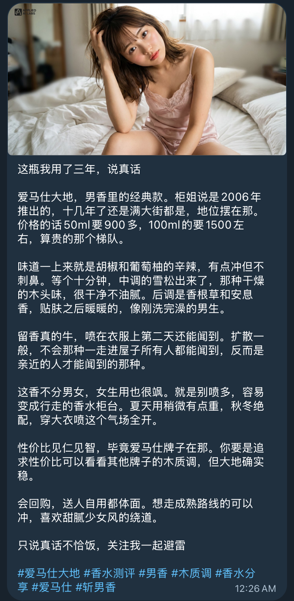
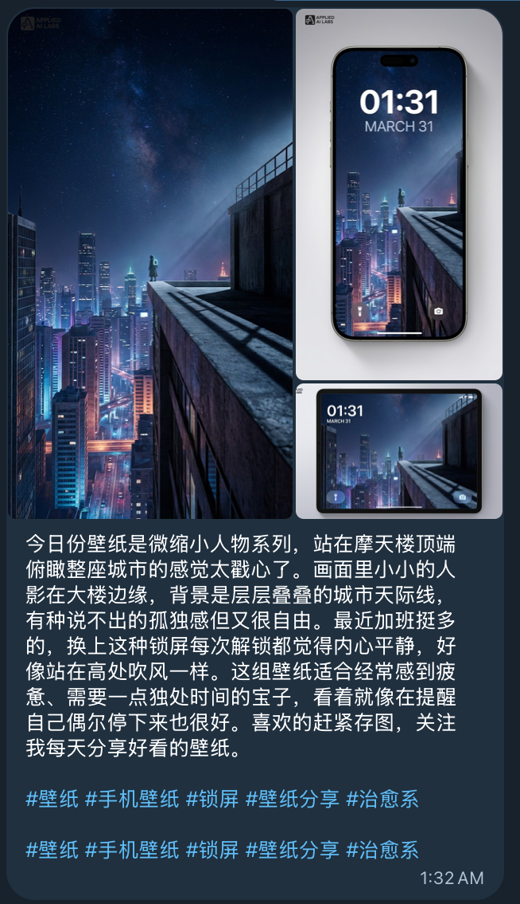
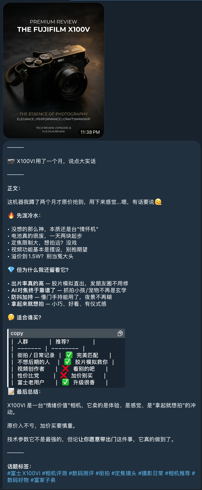
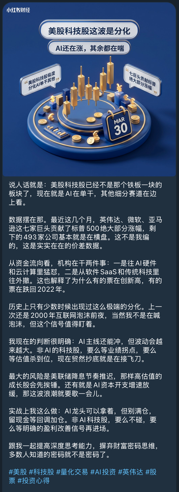

## 📖 项目介绍

**xiaohongshu-smart-gen** ———— 基于 OpenClaw 的小红书多垂类内容自动化生成 Skill

本工具通过 OpenClaw 实现从话题研究到内容创作的全链路自动化。采用配置驱动架构，支持金融、股票、美妆、科技、壁纸等多个垂类，每个垂类拥有独立的人设和内容风格。

内置的专业人设框架确保内容高质量、有特色，拒绝 AI 模式化表达。支持一键生成图文内容（壁纸垂类支持多图生成），极大提升内容生产效率。

<div align="center">


</div>

<div align="center">

**小红书智能内容生成系统** — 多垂类，配置驱动

`研究` → `内容` → `验证` → `封面` → `发布`

</div>

## ✨ 示例效果

<div align="center">

<table>
<tr>
<td align="center" width="50%">

<br />
<b>美妆护肤</b>
<td align="center" width="50%">

<br />
<b>壁纸分享</b>
</td>
</td>
</tr>
<tr>
<td align="center" width="50%">

<br />
<b>数码科技</b>
</td>
<td align="center" width="50%">

<br />
<b>金融投资</b>
</td>
</tr>
</table>

</div>

### 为什么需要这个工具？

- **节省时间**：从话题到发布，原本需要 1-2 小时的工作，现在几分钟完成
- **专业视角**：每个垂类独立人设，确保内容专业、有深度，拒绝 AI 感
- **配置驱动**：新增垂类只需添加配置，无需修改代码
- **风格统一**：遵循预设的人设规范，保持内容风格一致性

## 核心特性

| 特性 | 说明 |
|------|------|
| 📊 **多垂类支持** | 金融、股票、美妆、科技、壁纸 |
| ✍️ **人设写作** | 每个垂类独立人设，口语化，拒绝 AI 痕迹 |
| 🎨 **AI 封面** | 大片感背景图，多尺寸支持 |
| 🖼️ **多图生成** | 壁纸垂类支持 3 张图（壁纸 + iPhone/iPad 展示） |
| 📤 **一键发布** | 自动发送到 Telegram |
| 🔧 **配置驱动** | 新增垂类只需 JSON 配置 |

## 支持的垂类

| 垂类 | 代码 | 人设 | 特点 |
|------|------|------|------|--------|
| 金融投资 | `finance` | 量化交易员 | 数据驱动，风险提示 |
| 股票分析 | `stock` | 股票分析师 | 实时行情，数据驱动 |
| 美妆护肤 | `beauty` | 资深博主 | 真实测评，避坑指南 |
| 数码科技 | `tech` | 专业测评人 | 参数分析，购买建议 |
| 壁纸分享 | `wallpaper` | 壁纸设计师 | 治愈系，多图生成 |

## 使用方法

### CLI 命令

```bash
# 设置工作目录
cd ~/.openclaw/skills/xiaohongshu-smart-gen

# 完整生成（内容 + 封面 + 发送）
python3 scripts/cli.py generate finance "PLTR还能追吗"

# 分步执行
python3 scripts/cli.py content finance "PLTR"
python3 scripts/cli.py cover finance "PLTR"
python3 scripts/cli.py send <session_dir>

# 查看信息
python3 scripts/cli.py info <session_dir>
python3 scripts/cli.py list
python3 scripts/cli.py verticals
```

### 参数说明

| 参数 | 说明 | 必需 | 默认值 |
|------|------|------|--------|
| `<vertical>` | 垂类代码 (finance/stock/beauty/tech/wallpaper) | 是 | - |
| `<topic>` | 内容主题 | 是 | - |
| `--max-retries` | 内容生成最大重试次数 | 否 | 2 |

## 安装

### 一键安装

```bash
~/.openclaw/skills/xiaohongshu-smart-gen/scripts/install.sh
```

### 手动安装

#### 1. 系统依赖

**macOS (Homebrew)**:
```bash
brew install imagemagick python3 uv
```

#### 2. 配置 API Key

创建 `~/.openclaw/openclaw.json`:

```json
{
  "env": {
    "GEMINI_API_KEY": "your-api-key-here"
  }
}
```

获取 API Key: https://makersuite.google.com/app/apikey

#### 3. 安装依赖技能

```bash
openclaw skill install nano-banana-pro
```

## 目录结构

```
xiaohongshu-smart-gen/
├── SKILL.md              # 技能定义
├── README.md             # 本文件
├── verticals/            # 垂类配置
│   ├── finance.json      # 金融垂类
│   ├── stock.json        # 股票垂类
│   ├── beauty.json       # 美妆垂类
│   ├── tech.json         # 科技垂类
│   └── wallpaper.json    # 壁纸垂类
├── personas/             # 人设规范
│   ├── finance.md        # 交易员人设
│   ├── stock.md          # 股票分析人设
│   ├── beauty.md         # 博主人设
│   ├── tech.md           # 测评人人设
│   └── wallpaper.md      # 壁纸设计师人设
├── scripts/
│   ├── cli.py            # 主 CLI 命令
│   ├── lib/              # 核心库
│   │   ├── steps.py      # 生成步骤
│   │   ├── image_gen.py  # 图片生成
│   │   ├── session.py    # Session 管理
│   │   └── validate.py   # 内容验证
│   └── install.sh        # 一键安装脚本
├── assets/
│   └── logo/             # 各垂类 Logo
└── demo/                 # 示例效果
```

## License

MIT
